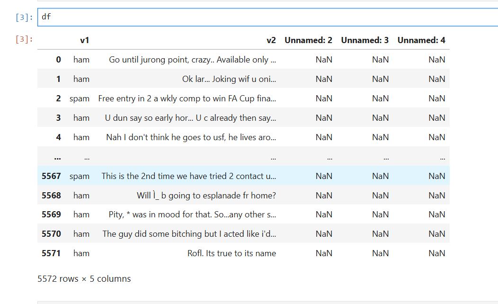
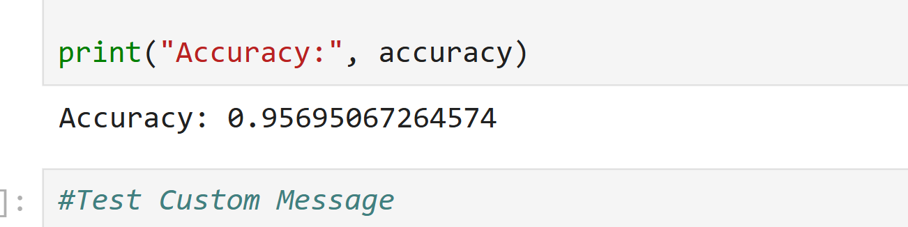
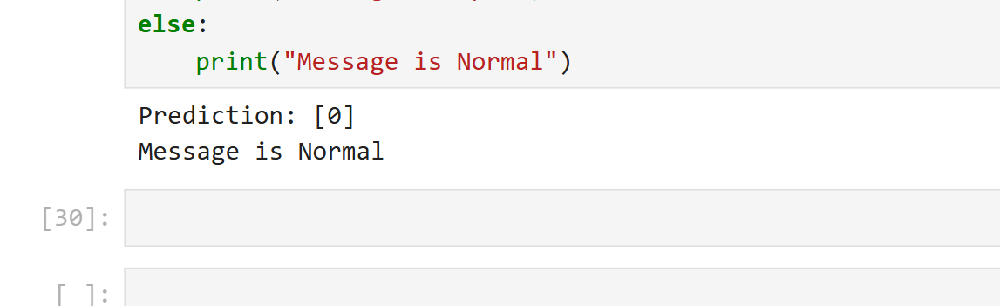

# 📩 SMS Spam Detection System using NLP and Machine Learning

## 📌 Project Overview

This project is an NLP-based SMS Spam Detection System developed using Python and Machine Learning. The system classifies SMS messages into:

* Spam Message
* Normal (Ham) Message

The project uses Natural Language Processing (NLP) techniques and a Multinomial Naive Bayes classifier to detect spam messages with high accuracy.

---

# 🚀 Features

* SMS Spam Classification
* Text Preprocessing
* TF-IDF Vectorization
* Machine Learning Model Training
* Real-time Message Prediction
* Accuracy Evaluation
* Beginner-Friendly NLP Project

---

# 🛠️ Technologies Used

* Python
* Pandas
* NumPy
* Scikit-learn
* NLP
* TF-IDF Vectorizer
* Multinomial Naive Bayes
* Jupyter Notebook

---

# 📂 Dataset

Dataset Used:

* SMS Spam Collection Dataset
* Contains 5,000+ SMS messages
* Labels:

  * ham → Normal Message
  * spam → Spam Message

---

# 📁 Project Structure

```bash
SMS-Spam-Detection/
│
├── spam.csv
├── spam_detection.ipynb
├── requirements.txt
├── README.md
└── images/
    ├── dataset.png
    ├── accuracy.png
    └── prediction.png
```

---

# ⚙️ Installation

## Step 1 — Install Required Libraries

```bash
pip install pandas numpy scikit-learn nltk
```

---

# ▶️ Run Project

Open Jupyter Notebook:

```bash
jupyter notebook
```

Then open:

```bash
spam_detection.ipynb
```

---

# 🧹 Text Preprocessing

The following preprocessing steps were applied:

* Convert text to lowercase
* Remove punctuation
* Clean unwanted symbols
* Transform text into numerical vectors

Example:

```text
Before: WIN CASH NOW!!!
After : win cash now
```

---

# 🔍 TF-IDF Vectorization

TF-IDF converts text messages into numerical vectors so that machine learning models can understand the text data.

Formula:

TF-IDF = Term Frequency × Inverse Document Frequency

---

# 🤖 Machine Learning Model

Algorithm Used:

## Multinomial Naive Bayes

Why Naive Bayes?

* Fast and efficient
* Performs well on text classification
* Suitable for NLP problems
* Works effectively with TF-IDF features

---

# 📊 Model Accuracy

The model achieved approximately:

## ✅ 95% – 98% Accuracy

---

# 🧪 Sample Prediction

## Input Message

```text
Congratulations! You won a free gift.
```

## Output

```text
Spam Message
```

---

# 🖼️ Output Screenshots

## Dataset Preview



---

## Accuracy Output



---

## Spam Prediction Output



---

# 📜 Requirements

Create a `requirements.txt` file:

```text
pandas
numpy
scikit-learn
nltk
```

---

# 💻 Sample Prediction Code

```python
msg = ["Hey, are you coming to college today?"]

msg_vector = tfidf.transform(msg)

prediction = model.predict(msg_vector)

print(prediction)
```

---

# 📈 Learning Outcomes

Through this project, I learned:

* Natural Language Processing workflow
* Text preprocessing techniques
* TF-IDF feature extraction
* Machine learning model training
* Spam message classification
* Model evaluation using accuracy score
* GitHub project documentation

---

# 🔮 Future Improvements

* Streamlit Web Application
* Flask Deployment
* Deep Learning Models (LSTM)
* Real-time Spam Detection
* Confusion Matrix Visualization
* Word Cloud Visualization

---

# 📌 Resume Description

* Developed an NLP-based SMS Spam Detection System using Python and Scikit-learn.
* Applied text preprocessing and TF-IDF vectorization on 5,000+ SMS records.
* Trained a Multinomial Naive Bayes model achieving 95%+ accuracy.

---

# 🙋‍♀️ Author

## Pranali Valve

Aspiring Data Analyst | Python Developer | AI & NLP Enthusiast
